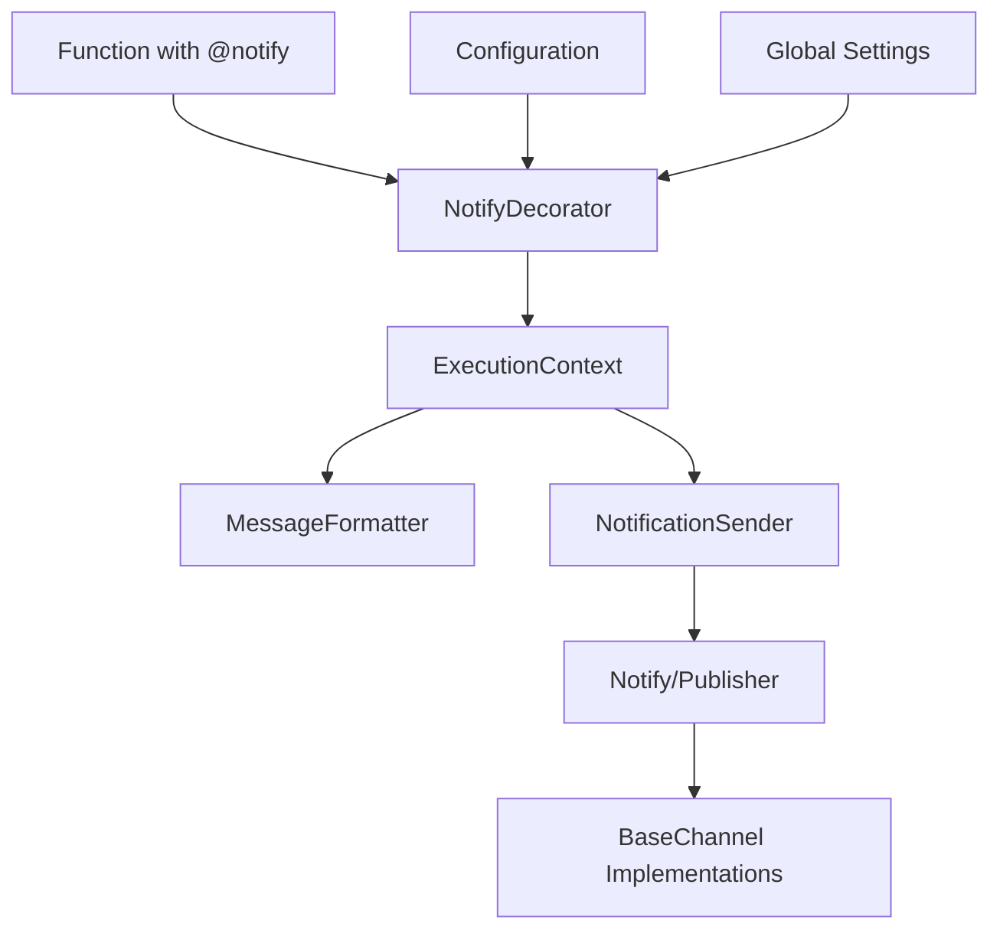
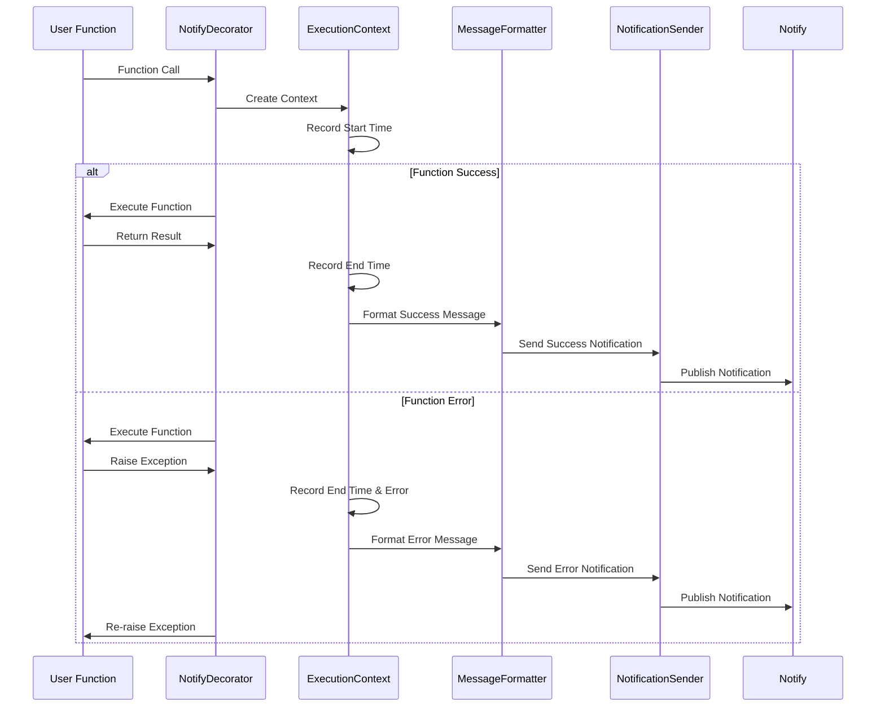

# 设计文档

## 概述

本设计文档描述了为 use_notify 库添加 `@notify` 装饰器功能的技术实现方案。该装饰器将允许开发者通过简单的装饰器语法在函数执行完成后自动发送通知，支持同步和异步函数，并提供丰富的配置选项。

装饰器将与现有的 `Notify` 和 `Publisher` 类集成，复用现有的通知渠道基础设施，确保功能的一致性和可维护性。

## 架构

### 核心组件架构



### 装饰器工作流程



## 组件和接口

### 1. NotifyDecorator 类

主要的装饰器实现类，负责包装函数并处理通知逻辑。

```python
class NotifyDecorator:
    def __init__(
        self,
        notify_instance: Optional[Notify] = None,
        title: Optional[str] = None,
        success_template: Optional[str] = None,
        error_template: Optional[str] = None,
        notify_on_success: bool = True,
        notify_on_error: bool = True,
        include_args: bool = False,
        include_result: bool = False,
        timeout: Optional[float] = None
    ):
        pass
    
    def __call__(self, func: Callable) -> Callable:
        pass
    
    def _wrap_sync_function(self, func: Callable) -> Callable:
        pass
    
    def _wrap_async_function(self, func: Callable) -> Callable:
        pass
```

### 2. ExecutionContext 类

记录函数执行上下文信息，包括执行时间、参数、返回值等。

```python
@dataclass
class ExecutionContext:
    function_name: str
    start_time: datetime
    end_time: Optional[datetime] = None
    args: tuple = field(default_factory=tuple)
    kwargs: dict = field(default_factory=dict)
    result: Any = None
    exception: Optional[Exception] = None
    execution_time: Optional[float] = None
    
    def mark_success(self, result: Any) -> None:
        pass
    
    def mark_error(self, exception: Exception) -> None:
        pass
    
    @property
    def is_success(self) -> bool:
        pass
```

### 3. MessageFormatter 类

负责格式化通知消息内容。

```python
class MessageFormatter:
    DEFAULT_SUCCESS_TEMPLATE = "✅ 函数 {function_name} 执行成功\n⏱️ 执行时间: {execution_time:.2f}秒"
    DEFAULT_ERROR_TEMPLATE = "❌ 函数 {function_name} 执行失败\n⏱️ 执行时间: {execution_time:.2f}秒\n🚨 错误信息: {error_message}"
    
    def __init__(
        self,
        success_template: Optional[str] = None,
        error_template: Optional[str] = None,
        include_args: bool = False,
        include_result: bool = False
    ):
        pass
    
    def format_success_message(self, context: ExecutionContext) -> dict:
        pass
    
    def format_error_message(self, context: ExecutionContext) -> dict:
        pass
    
    def _safe_serialize(self, obj: Any, max_length: int = 200) -> str:
        pass
```

### 4. NotificationSender 类

处理通知发送逻辑，包括错误处理和超时控制。

```python
class NotificationSender:
    def __init__(
        self,
        notify_instance: Notify,
        timeout: Optional[float] = None
    ):
        pass
    
    def send_notification(self, title: str, content: str) -> None:
        pass
    
    async def send_notification_async(self, title: str, content: str) -> None:
        pass
    
    def _handle_send_error(self, error: Exception) -> None:
        pass
```

### 5. 装饰器工厂函数

提供便捷的装饰器创建接口。

```python
def notify(
    notify_instance: Optional[Notify] = None,
    title: Optional[str] = None,
    success_template: Optional[str] = None,
    error_template: Optional[str] = None,
    notify_on_success: bool = True,
    notify_on_error: bool = True,
    include_args: bool = False,
    include_result: bool = False,
    timeout: Optional[float] = None
) -> Callable:
    """
    创建通知装饰器的工厂函数
    """
    pass
```

## 数据模型

### 配置数据模型

```python
@dataclass
class NotifyConfig:
    notify_instance: Optional[Notify] = None
    title: Optional[str] = None
    success_template: Optional[str] = None
    error_template: Optional[str] = None
    notify_on_success: bool = True
    notify_on_error: bool = True
    include_args: bool = False
    include_result: bool = False
    timeout: Optional[float] = None
    
    def validate(self) -> None:
        """验证配置参数的有效性"""
        pass
```

### 消息数据模型

```python
@dataclass
class NotificationMessage:
    title: str
    content: str
    timestamp: datetime
    function_name: str
    execution_time: float
    is_success: bool
    
    def to_dict(self) -> dict:
        pass
```

## 错误处理

### 错误处理策略

1. **通知发送失败**：记录错误日志，不影响原函数执行
2. **配置错误**：在装饰器初始化时抛出清晰的错误信息
3. **序列化错误**：对于无法序列化的对象，使用安全的字符串表示
4. **超时处理**：支持设置通知发送超时，避免阻塞原函数

### 异常类定义

```python
class NotifyDecoratorError(Exception):
    """装饰器基础异常类"""
    pass

class NotifyConfigError(NotifyDecoratorError):
    """配置错误异常"""
    pass

class NotifySendError(NotifyDecoratorError):
    """通知发送错误异常"""
    pass
```

### 日志记录

使用 Python 标准库的 logging 模块记录关键操作和错误信息：

- DEBUG 级别：记录装饰器执行流程
- INFO 级别：记录通知发送成功信息
- WARNING 级别：记录通知发送失败但不影响主流程的情况
- ERROR 级别：记录严重错误信息

## 测试策略

### 单元测试

1. **装饰器功能测试**
   - 同步函数装饰测试
   - 异步函数装饰测试
   - 参数传递测试
   - 返回值处理测试

2. **消息格式化测试**
   - 成功消息格式化
   - 错误消息格式化
   - 模板自定义测试
   - 参数包含测试

3. **通知发送测试**
   - 成功通知发送
   - 失败通知发送
   - 超时处理测试
   - 错误处理测试

4. **配置验证测试**
   - 有效配置测试
   - 无效配置测试
   - 默认配置测试

### 集成测试

1. **与现有通知系统集成**
   - 与 Notify 类集成测试
   - 与各种通知渠道集成测试
   - 多渠道通知测试

2. **实际使用场景测试**
   - 长时间运行函数测试
   - 高频调用函数测试
   - 异常处理场景测试

### 性能测试

1. **装饰器开销测试**：确保装饰器不会显著影响函数执行性能
2. **通知发送性能测试**：测试异步通知发送的性能表现
3. **内存使用测试**：确保装饰器不会造成内存泄漏

## 使用示例

### 基础使用

```python
from use_notify import useNotify
from use_notify.decorator import notify

# 使用默认配置
@notify()
def long_running_task():
    # 执行长时间任务
    time.sleep(10)
    return "任务完成"

# 使用自定义通知实例
notify_instance = useNotify.from_settings({
    "BARK": {"token": "your_token"}
})

@notify(notify_instance=notify_instance, title="重要任务")
def important_task():
    # 执行重要任务
    return "重要任务完成"
```

### 高级配置

```python
@notify(
    title="数据处理任务",
    success_template="✅ {function_name} 处理了 {args[0]} 条数据，耗时 {execution_time:.2f}秒",
    error_template="❌ {function_name} 处理失败: {error_message}",
    include_args=True,
    include_result=True,
    notify_on_success=True,
    notify_on_error=True,
    timeout=30.0
)
def process_data(data_count: int):
    # 处理数据
    return f"处理了 {data_count} 条数据"
```

### 异步函数支持

```python
@notify(title="异步任务")
async def async_task():
    await asyncio.sleep(5)
    return "异步任务完成"
```